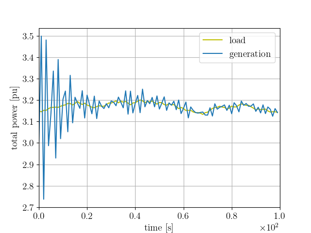

# Deep Multi-Agent Reinforcement Learning for Cost-Efficient Distributed Load Frequency Control

by
Sergio Rozada,
Dimitra Apostolopoulou
and Eduardo Alonso

This code belongs to a paper that has been published in *IET Energy Systems Integration*.

> The associated paper presents Multi-Agent Reinforcement Learning (MARL) methods to implement cost-efficient load frequency controls without the need of a centralized authority.

    

* Tertiary Control Model I: Cost-optimal total power developed in a two-agents system after a change in load by 0.15pu followed by continuous changes in the load.*

## Abstract

> The rise of microgrid-based architectures is modifying significantly the energy control landscape in distribution systems, making distributed control mechanisms necessary to ensure reliable power system operations. In this paper, we propose the use of Reinforcement Learning techniques to implement load frequency control (LFC) without requiring a central authority. To this end, we formulate a detailed model of power system dynamic behaviour by representing individual generator dynamics, generator rate and network constraints, renewable-based generation and realistic load realisations. We recast the LFC problem as a Markov Decision Process and use the Multi-Agent Deep Deterministic Policy Gradient algorithm to approximate the optimal solution of all LFC layers, i.e., primary, secondary and tertiary. The proposed LFC framework operates through centralised learning and distributed implementation. In particular, there is no information interchange between generating units during operation thus no communication infrastructure is necessary and information privacy between them is respected. We validate our proposed framework through numerical results and show that it can be used to implement the LFC in a distributed and cost-efficient manner.

## Software implementation

This repository contains the code of the paper 
*Deep Multi-Agent Reinforcement Learning for Cost Efficient Distributed 
Load Frequency Control*. The repository is distributed as follows:
* **dynamics.py**: contains the dynamics of the power system.
* **rl.py**: contains RL ancillary functions to train the models.
* **architecture.py**: contains the network architectures used.
* **training files**: all files starting by **train_** contains all the RL experiments.
* **test files**: all files starting by **test_** contains all the tests and figures.
* **other methods**: baseline methods can be found in **distributed_optimal_control.py**
  , and **distributed_optimal_control_network.py**.

  ## Getting the code

You can download a copy of all the files in this repository by cloning the
[git](https://github.com/sergiorozada12/frequency-control-maddpg) repository:

    git clone https://github.com/sergiorozada12/frequency-control-maddpg.git

or [download a zip archive](https://github.com/sergiorozada12/frequency-control-maddpg/archive/refs/heads/master.zip).